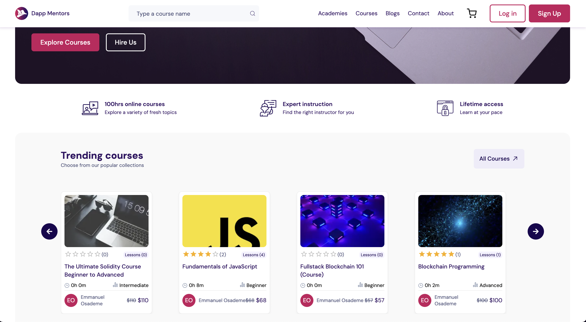

# People Learn Frontend Documentation

## Overview

People Learn is an online learning platform that provides users with access to a variety of courses, lessons, and other educational resources. This document outlines the frontend architecture and environment setup for the People Learn project. The frontend is built using React and Next.js, with Redux for state management, and it interacts with the backend services to provide a seamless user experience.

## Environment Variables

The frontend of People Learn relies on several environment variables for configuration. These variables are defined in the `.env` file and are crucial for the application's operation. Below is a list of the required environment variables with null values for the viewer to replace with their corresponding values:

### General Configuration

- `NEXT_PUBLIC_BACKEND_URI`: The base URL of the backend API.

## Services

The frontend of People Learn consumes various backend services to provide a comprehensive learning experience. These services include:

- `createPost`: Creates a new post.
- `updatePost`: Updates an existing post.
- `deletePost`: Deletes a post.
- `publishPost`: Publishes a post.
- `updateAcademy`: Updates an academy.
- `login`: Authenticates a user.
- `logout`: Logs out a user.
- `createAccount`: Registers a new user.
- `createAcademy`: Creates a new academy.
- `createCourse`: Creates a new course.
- `updateCourse`: Updates an existing course.
- `createLesson`: Creates a new lesson.
- `updateLesson`: Updates an existing lesson.
- `submitCourse`: Submits a course for approval.
- `deleteCourse`: Deletes a course.
- `addCourseToAcademy`: Adds a course to an academy.
- `removeCourseFromAcademy`: Removes a course from an academy.
- `fetchAcademy`: Fetches details of an academy.
- `fetchCourses`: Fetches a list of courses.
- `deleteAcademy`: Deletes an academy.
- `submitAcademy`: Submits an academy for approval.
- `approveAcademy`: Approves an academy.
- `approveCourse`: Approves a course.
- `fetchAcademies`: Fetches a list of academies.
- `fetchBooks`: Fetches a list of books.
- `fetchPosts`: Fetches a list of posts.
- `fetchPost`: Fetches details of a post.
- `fetchCourse`: Fetches details of a course.
- `fetchReviews`: Fetches a list of reviews.
- `fetchLesson`: Fetches details of a lesson.
- `deleteLesson`: Deletes a lesson.
- `fetchUsers`: Fetches a list of users.
- `upgradeUser`: Upgrades a user's account.
- `fetchUserSubscriptions`: Fetches a user's subscriptions.
- `fetchUserPosts`: Fetches a user's posts.
- `upgradeUserRequest`: Requests an account upgrade.
- `stripeSubscription`: Subscribes a user to a Stripe plan.
- `uploadFile`: Uploads a file to the Sia storage service.
- `createWishlist`: Creates a new wishlist.
- `deleteWishlist`: Deletes a wishlist.
- `fetchWishlists`: Fetches a user's wishlists.
- `stripeCheckout`: Initiates a Stripe checkout session.
- `publishPost`: Publishes a post.
- `createReview`: Creates a new review.

## Getting Started

To get started with the People Learn frontend, clone the repository and install the dependencies. Then, create a `.env` file in the root directory of the project and populate it with the required environment variables as outlined above. Finally, run the application using the command `npm run dev` or `yarn dev`.

## Contributing

People Learn is an open-source project. Contributions are welcome! Please read the contributing guidelines before submitting pull requests.

## License

People Learn is licensed under the MIT License. See the LICENSE file for more details.